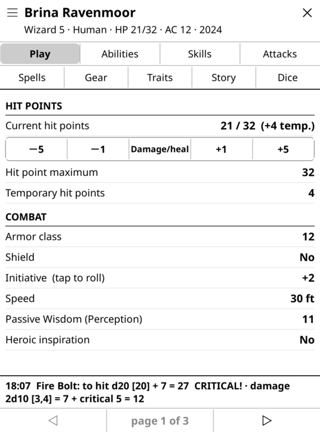
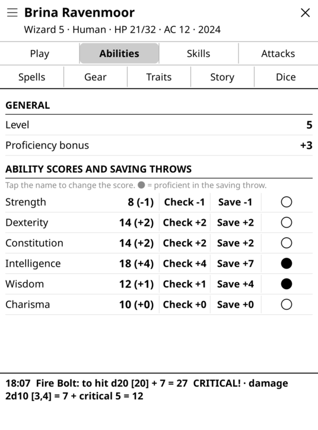
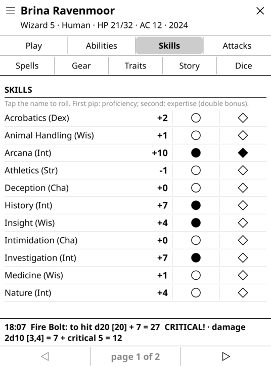
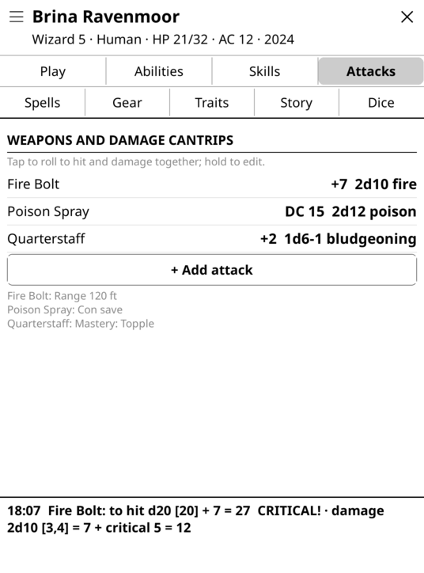
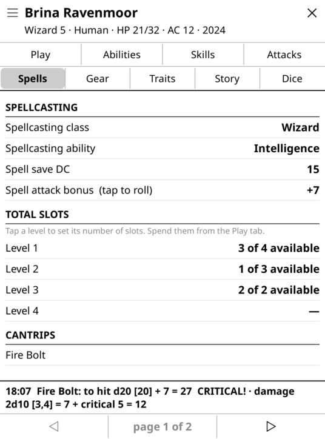
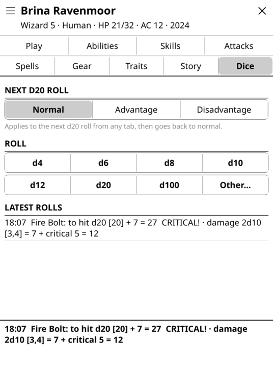

# D&D 5e character sheets for KOReader

A Dungeons & Dragons 5th edition character sheet for [KOReader](https://koreader.rocks), designed for e-ink readers. Fill in your character, track hit points, spell slots and hit dice during the session, and roll dice right from the sheet.

Both rule sets are supported: **2014** and **2024**. You pick the edition when you create a character and can switch it later; the sheet shows the fields of that edition's official character sheet.

[Italiano più sotto](#italiano)

| Play | Abilities | Skills |
|---|---|---|
|  |  |  |
| **Attacks** | **Spells** | **Dice** |
|  |  |  |

## Features

- **Play**: hit points with quick damage and healing (damage goes to temporary HP first), armor class, initiative, inspiration, hit dice, death saves, spell slots to tick off, long rest, session notes.
- **Abilities and skills**: modifiers, saving throws, proficiency and expertise are calculated for you. Tap a name to roll.
- **Attacks**: one tap rolls to hit and damage together, with critical hits on a natural 20. An attack can use a save DC instead of an attack bonus (e.g. a cantrip): then only damage is rolled.
- **Spells**: spellcasting ability, save DC and attack bonus; spells by level with prepared, concentration, ritual and material markers, casting time and range.
- **Gear, traits, story**: the rest of the sheet, including coins (type `+10` or `-5` to add or remove).
- **Dice**: d4 to d100, free expressions such as `2d6+3`, advantage or disadvantage on the next d20, history of the last 30 rolls.
- Several characters, each saved in its own file. Every change is saved immediately.
- English and Italian. The language follows KOReader's; you can force one from the gear icon in the character list.

## Installation

- **With [Storefront](https://github.com/ultimatejimmy/storefront.koplugin)**: search for "dnd5e-sheets" in the Plugins tab.
- **By hand**: download `dnd5e.koplugin-vX.Y.Z.zip` from the [latest release](../../releases/latest), unzip it and copy the `dnd5e.koplugin` folder into KOReader's `plugins` folder (on Kobo: `.adds/koreader/plugins/`). Restart KOReader.

Open it from **Tools → D&D 5e character sheets**. Two actions can be bound to a gesture: "open the last character" and "character list".

Tested with KOReader v2026.07.1 on a Kobo Glo HD.

## Your data

Each character is a plain Lua file in `koreader/settings/dnd5e/<id>.lua` (on Kobo: `.adds/koreader/settings/dnd5e/`), with a `.old` copy of the previous version next to it. To back up or move your characters, copy that folder.

## Translations

Texts in the code are English. Each other language is a file in `l10n/` that maps English strings to translations. To add one:

1. copy `l10n/it.lua` to `l10n/<code>.lua` (two-letter code, e.g. `fr.lua`) and translate the values;
2. add the language's name to `I18n.NAMES` in `dnd5e_i18n.lua`;
3. check that nothing is missing: `luajit tools/check_l10n.lua <code>`.

Keys like `"size|Medium"` carry a context, for words that English uses in two senses. Pull requests are welcome.

## License

[AGPL-3.0](LICENSE), like KOReader.

This is an unofficial fan project, not affiliated with or endorsed by Wizards of the Coast. Dungeons & Dragons and D&D are trademarks of Wizards of the Coast LLC. The plugin contains no rules text: only the names of the fields on the character sheet.

---

## Italiano

Scheda del personaggio di Dungeons & Dragons 5ª edizione per KOReader, pensata per i lettori e-ink: compili il personaggio, durante la sessione tieni traccia di punti ferita, slot incantesimo e dadi vita, e tiri i dadi direttamente dalla scheda.

Supporta le regole **2014** e **2024**: l'edizione si sceglie quando crei il personaggio e si può cambiare dopo; la scheda mostra i campi della scheda ufficiale di quell'edizione, con i termini dei manuali italiani.

**Installazione**: da [Storefront](https://github.com/ultimatejimmy/storefront.koplugin) cerca "dnd5e-sheets", oppure scarica lo zip dall'[ultima release](../../releases/latest) e copia la cartella `dnd5e.koplugin` in `.adds/koreader/plugins/` sul Kobo. Si apre da **Strumenti → Schede D&D 5e**.

La lingua segue quella di KOReader; si può forzare dall'icona dell'ingranaggio nell'elenco dei personaggi. I personaggi stanno in `.adds/koreader/settings/dnd5e/`, un file per personaggio: per il backup basta copiare la cartella.
